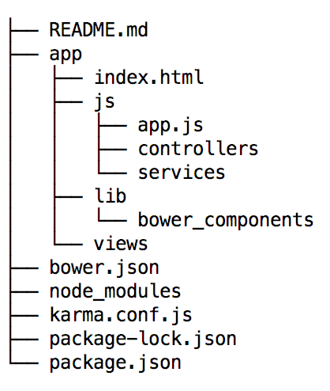

# Day 2

## Description

Today we will be introducing the front-end technologies for the app. We will go through an overview of the
dependency managers, the set-up for a typical web-app and finally we will create a coding example in the context of a messaging app.
By the end of this module, you should be a little bit more familiar with the Opal
application set up, the common AngularJS flow, OnsenUI flow, and ultimately how to
 set-up a project using these technologies. We will set-up testing, but we will
 not take care of that until later (once I have a chance to catch up! ;p).

## Homework
Readings:
- HTML introduction: https://www.w3schools.com/html/default.asp
Please read all of this guide. Its important to understand the basic
tags as Angular builds on top of this to create their own tags which will
have enhance functionality.
- JS introduction: https://www.w3schools.com/js/default.asp
This will be a great introduction to how JavaScript interacts with the
DOM natively. Every year the [ECMAScript](https://en.wikipedia.org/wiki/ECMAScript)
organization gets together and decides on how the JavaScript standard for the web
is going to evolve, this will include neat new features, or simply fixes
to previous API. Their main job is to provide an API that JavaScript uses inside a browser
to interact with the DOM tree, and to do other important functions such as a
a request to a server via a [get request](https://www.w3schools.com/tags/ref_httpmethods.asp).
Angular builds on top of this basic JavaScript API in two ways, first
it creates more  complex functionality and second it wraps this functions and offers
them to the user under the Angular paradigm.
- Git tutorial by Logan Montgomery: [git tutorial](https://docs.google.com/document/d/16PSag95XtbPKWGNi2K5PCtYNoGMo-haOJV3nsPXc2Z0/edit?usp=sharing),
please go through this tutorial, it will covers ome of the basic of Git.

## Resources
This might be a lot to process, to aid this process, the following resources
will help you plus the resources I will be adding along with the tutorial.
- [Code Academy](https://www.codecademy.com/) - Intro. Tutorials on JS, HTML, CSS, AngularJS
- [AngularJS Documentation](https://docs.angularjs.org/api)
- [OnsenUI Documentation] (https://onsen.io/v1/guide.html)
- [Styling guide AngularJS](https://github.com/johnpapa/angular-styleguide/blob/master/a1/README.md) Please
    use this style guide when writing your AngularJS code. It makes the code clean,
    consistent, and easy to use for people that follow.
- [HTML W3School](https://www.w3schools.com/html/default.asp)
- [AngularJS W3Schools](https://www.w3schools.com/angular/default.asp)

## Hello World the Opal Way

After this mini-tutorial you should have an idea of what the config files
do in our Angular application, how you'd go about creating each of them and
lastly your first web app, i.e. Hello World the opal front-end way :)


### Instructions

1. Install bower, npm, and gulp globally.
2. Run `$ npm init`, this will initialize your project development dependencies, creating a config file named package.json
it will ask common questions for a project set up such as the description, the version, and the name of the project.
3. Add bower as a development dependency `$ npm install bower --save-dev`
This will be the front-end dependency manager, this will handle and all our front-end dependencies
4. Run `$ bower init`, similarly as above, this will initialize your configuraton file
    for front-end dependencies creating a bower.json file.
5. Create a .bowerrc file to configure bower and add the contents as follows:
    ```
    {
        "directory":"app/lib/bower_components"
    }
    ```

This will install the added bower dependencies in the path pointed by "directory",
normally your application code lives in the app folder. The lib folder is the
place where you place all your application external libraries and dependencies.


6. Now its time to add and install our two major frameworks and front-end dependencies.
  ```
    bower install onsenui#1.3.16 --save
    bower install angular#1.4.14 --save
  ```


- The `--save` flag saves both of those dependencies in the bower.json file as actual project dependencies
OnsenUI and AngularJS are the two JavaScript dependencies we use in the app.
- AngularJS, provides a framework for thinking about the logic of a web-app building
on top of the __MVC__ design pattern. Here is a small introduction: https://docs.angularjs.org/guide/concepts
- OnsenUI is a CSS/JavaScript that provides out of the box components that are mobile
    looking, it allows a web-app to look and feel like a mobile app.
    Look through the start page on OnsenUI https://onsen.io/v1/guide.html,
    note that we will be working with version 1 of this framework. When you are going
    through the documentation make sure of that.


7. Start our index.html file with both of our dependencies.
```
<!DOCTYPE html>
<html lang="en">
<head>
    <meta http-equiv="content-type" content="text/html; charset=utf-8" />
    <title>Title</title>
    <link rel="stylesheet" href="lib/bower_components/OnsenUI/css/onsen-css-components.css">
    <link rel="stylesheet" href="lib/bower_components/OnsenUI/css/onsenui.css">
    <script src="lib/bower_components/angular/angular.min.js" type="application/javascript"></script>
    <script src="lib/bower_components/OnsenUI/js/onsenui.min.js" type="application/javascript"></script>
</head>
<body >


</body>

</html>

```
- Here we are adding 4 files. Two stylesheets, which will be the Onsen CSS components,
  and 2 JavaScript files, which will load the AngularJS framework and OnsenUI.
- See [OnsenUI Getting Started](https://onsen.io/v1/guide.html) if you have any problems.
  Your index.html page is the only page that will be loaded in your application,
  Angular will take care of dynamically swapping dependencies in and out within that page.
  It will also do other things like controlling the url, as to give the illusion of a
  multi-page app, and controlling your state via their Angular directives which
  always start with an `ng`.

8. Run server and test no errors, make sure to open in Chrome.
```
    http-server ./app -p 9000
```
To test for errors check the console by inspecting the page and choosing `console` on the
top bar of the browser. Let's also disable the cache on the site
by going into the `network` tab of the debugging tools and
[selecting](https://www.technipages.com/google-chrome-how-to-completely-disable-cache)
the `disable cache` box.

9. Now its time to start building the app. Angular app is bootstrapped by the
module config function. To do this, we do two different things.
First, we create a tag on the `index.html` as to tell Angular
where to start nesting the application.
```
<!DOCTYPE html>
<html lang="en">
<head>
    <meta http-equiv="content-type" content="text/html; charset=utf-8" />
    <title>Title</title>
    <link rel="stylesheet" href="lib/bower_components/OnsenUI/css/onsen-css-components.css">
    <link rel="stylesheet" href="lib/bower_components/OnsenUI/css/onsenui.css">
    <script src="lib/bower_components/angular/angular.min.js" type="application/javascript"></script>
    <script src="lib/bower_components/OnsenUI/js/onsenui.min.js" type="application/javascript"></script>
</head>
<body ng-app="messaging-app">


</body>

</html>
```
Here we have told Angular to start our application from the body tag of our html tree.
Secondly, we instantiate the module, i.e.
```
angular.module("<name-module>",[<list-of-angular-dependencies>])
```
This will create an Angular module with the name given and declare
the set of Angular dependencies for the module.

10. Instantiating an angular module.
- Create 'app.js' file under the `app/js` directory and include

```
(function(){
    var module = angular.module("<name-module>",["onsen"]);


})();
```
This creates and defines the angular module and the angular dependencies,
 using the same name you used in the ng-app tag template, i.e. `messaging-app` (replace `"<name-module>"` with `"messaging-app"`).
  In terms of dependencies, `onsen` will be our only dependency.
   Notice the `(function(){})();`, this will encapsulate
our code as to not let variables escape from scope, if you
try to simply declare variables in a JavaScript file without function
encapsulating. You will risk having collision
problems between your variables of different files in the workspace.

- Now, link to app.js from index.html by adding the following line between the head tags in `index.html`.
```
   <script src="js/app.js" type="text/javascript"></script>
```

We are now ready to add logic to your app. We will create an onsen navigator,
an onsen page, and finally our logic for the hello world app.

11. To the index.html file, add the following between the <body> tags

```
    <ons-navigator var="navi" page="./views/hello-world.html"></ons-navigator>
```
This navigator instantiates the global variable `navi`, which will allow you to add and remove pages,
and in general manipulate the navigator. The url in the page attribute points to the root page for the
navigator. The navigator creates an stack of pages from which you will just push and pop.
See [page navigation](https://onsen.io/v1/guide.html#page-navigation) for more details on this.

12. Create a view called `hello-world.html` and place it under the views
directory. To this view, add the following ons-page.

```
<ons-page ng-controller="HelloWorldController as vm">
    <ons-toolbar>
      <div class="center">Simple Navigation</div>
    </ons-toolbar>
    <div style="text-align: center">
      <br>
      <!--TODO: Add the binding from the controller to print hello world on the page.-->
     <p></p>
    </div>
  </ons-page>
```
Notice the TODO task on the list, filled this app after the controller is done. This html create
and ons-page component which is the component pushed onto onsen navigators. The
ng-controller tag indicates the controller use for this view.

13. Create a controller called `helloWorldController.js` and place it under the js/controllers
directory.
Here are the contents for the controller.

```
(function(){
    var module = angular.module('<name-module>'); // Fetches the angular the module so that the controller can access it.

    module.controller("HelloWorldController",HelloWorldController); // Declares the component in the angular module


    HelloWorldController.$inject = []; // Injects the angular dependencies for this Controller


    function HelloWorldController(){ // function representing this controller, vm, is the equivalent of $scope
        var vm = this;
        // Create and attach hello_world variable to the vm object.

    }
)();
```

Again, replace `'<name-module>'` with `'messaging-app'`.

14. Add the controller to your index.html.

```
<!DOCTYPE html>
<html lang="en">
<head>
    <meta http-equiv="content-type" content="text/html; charset=utf-8" />
    <title>Title</title>
    <link rel="stylesheet" href="lib/bower_components/OnsenUI/css/onsen-css-components.css">
    <link rel="stylesheet" href="lib/bower_components/OnsenUI/css/onsenui.css">
    <script src="lib/bower_components/angular/angular.min.js" type="application/javascript"></script>
    <script src="lib/bower_components/OnsenUI/js/onsenui.min.js" type="application/javascript"></script>
</head>
<body ng-app="messaging-app">
    <ons-navigator var="navi" page="./views/hello-world.html"></ons-navigator>

    <!--Controllers-->
    <script src="js/controllers/helloWorldController.js" type="application/javascript"></script>

</body>

</html>

```

15. Add "Hello World" to the controller.

In `helloWorldController.js`, replace the line `// Create and attach hello_world variable to the vm object.` with the following:
```
    vm.hello = "Hello World!"
```

16. Link the controller variable 'hello' to the view.

In `hello-world.html`, replace the line `<!--TODO: Add the binding from the controller to print hello world on the page.-->` with the following:
```
    <h1>{{vm.hello}}</h1>
```
In the view, vm refers to the line at the top of the page `<ons-page ng-controller="HelloWorldController as vm">`, and `hello` is the variable defined in this controller. The curly brackets are used to express the contents of the variable instead of printing `vm.hello` in plain text to the screen.

17. Run the code and see if it works.
18. If the above fails, debug and figure out what's wrong :) Google is your friend and so am I.


Your folder should look like this at the end:




__Success__!!! You have now gone through the basic steps to get an AngularJS app
with our front-end technology stack! Now you are ready, to move on to your
first Angular Application.

If you have any problems, send me an e-mail to: davidfherrerar@gmail.com


## Testing. (you may skip his step and do it later)

Let's now install the Karma framework for unit testing.
1. Run
 ```
 npm install karma karma-jasmine jasmine-core karma-chrome-launcher karma-junit-reporter --save-dev
 npm instal -g karma-cli
 bower install angular-mocks#1.4.14 --save-dev

 ```
 Notice here again that this is an example of a development dependency, thus
 the `--save-dev` flag.
2. . Setup for AngularJS testing environment. To do this, run `$karma init karma.conf.js`,
choose the Jasmine Framework (AngularJS Framework, Require.js no (Since we are dealing
with a browser and Require.js is for server side JavaScript, a.k.a Node.js). Then go
through the rest of the default options choosing Chrome as your browser. This
will create a `karma.conf.js` file from the options you provided. Below is
my configuration.

```
// Karma configuration
// Generated on Sun May 06 2018 14:08:09 GMT-0400 (EDT)

module.exports = function(config) {
  config.set({

    // base path that will be used to resolve all patterns (eg. files, exclude)
    basePath: 'app',


    // frameworks to use
    // available frameworks: https://npmjs.org/browse/keyword/karma-adapter
    frameworks: ['jasmine'],


    // list of files / patterns to load in the browser
    files: [
	    'lib/bower_components/angular/angular.min.js',
	    'lib/bower_components/angular-mocks/angular-mocks.js',
	    'lib/bower_components/OnsenUI/js/onsenui.js',
    	'js/app.js',
        'js/controllers/**/*.js',
	    'js/services/**/*.js'

	    // 'js/**/*.js'
    ],


    // list of files / patterns to exclude
    exclude: [
    ],


    // preprocess matching files before serving them to the browser
    // available preprocessors: https://npmjs.org/browse/keyword/karma-preprocessor
    preprocessors: {
    },


    // test results reporter to use
    // possible values: 'dots', 'progress'
    // available reporters: https://npmjs.org/browse/keyword/karma-reporter
    // reporters: ['progress'],


    // web server port
    port: 9876,


    // enable / disable colors in the output (reporters and logs)
    colors: true,


    // enable / disable watching file and executing tests whenever any file changes
    autoWatch: true,


    // start these browsers
    // available browser launchers: https://npmjs.org/browse/keyword/karma-launcher
    browsers: ['Chrome'],
	  plugins: [
		  'karma-chrome-launcher',
		  'karma-jasmine',
		  'karma-junit-reporter'
	  ],
	  junitReporter: {
		  outputFile: 'test_out/unit.xml',
		  suite: 'unit'
	  },

    // Continuous Integration mode
    // if true, Karma captures browsers, runs the tests and exits
    singleRun: false,

    // Concurrency level
    // how many browser should be started simultaneous
    concurrency: Infinity
  })
};
```
This is the configuration file for the karma unit testing framework. Here we are specifying
things like our files that we want to test, the browser we want to test in, and the plugins
that make this possible. The `karam-chrome-plugin` for instance will allow you to run your tests
in Chrome automatically, `karma-jasmine` is the plugin that provides functions to interact
with the AngularJS environment. For more information look at the [Karma tutorial](http://www.bradoncode.com/blog/2015/05/19/karma-angularjs-testing/),
[AngularJS testing](https://docs.angularjs.org/guide/unit-testing)
3. Add the following key,value pair to the scripts object in your package.json replacing
the value currently present:
```
    scripts:{
        "test": "karma start karma.conf.js"
    }
```
This will allow you to run your tests as `$npm run test`. For now, do not worry too much
about testing. This will be a topic for later.


# Messaging app

The goal of this mini-project is to create a messaging app using this technology stack.
We will have three pages.
1. A page with a list of conversations: [Conversations](./images/image1.png)
2. A page to create conversations:[Create Conversations](./images/image6.png)
3. A conversation page, where we can delete conversations, and send messages:[Create Conversations](./images/image6.png)

For more details on the different views of this app, go through the images folder in this repository.

By the end of this, you should have an app where you can see all the conversations available,
 create conversations, and lastly,  navigate to an indinvidual conversation and be able to see the messages
 in the conversation, write messages in the conversation,
and lastly, delete the conversation.

To get guidance on how to write your controllers, services etc,
check the [styling guide for AngularJS](https://github.com/johnpapa/angular-styleguide/blob/master/a1/README.md)
## Getting started

1. Clone this repository.
2. Create a branch with your name and checkout the branch out, I will be looking at this to
review your code.
4. Install dependencies
5. Open the app in browser with our dear `http-server`
6. Go to the app.js file and instantiate the Angular module, do not forget to add 'onsen' as a
    dependency! This is important otherwise you will get an error when running the repository.
7. Please Read the whole spec below before. The instructions will be given after either way.

I have left my files there with deleted information and a bunch of TODOs, you may choose to
delete the and try to implement it yourself if you are comfortable enough. If not, follow along :)

Have Fun!
## MVC
As a reminder, we talked about the [Model-View-Controller](https://en.wikipedia.org/wiki/Model%E2%80%93view%E2%80%93controller)
 In this app, we will use one model, which will be our MessengerService,
here we will mock-up data which will simulate a server call. This model will serve
three controllers, the ConversationsController, the IndividualConversationController,
 and lastly, the NewConversationController. This controllers will be coupled with their
 respective view, and will control and sync the information between the model and the view.
 Here is a image of my directory tree: [tree](./images/image9.png)

Do not worry about the *.spec.js files for now. Those are the testing files.

## Views

To add your Onsen UI views the easy way visit: [Onsen Theme Roller](https://onsen.io/theme-roller/).
Pick OnsenUI version <=2.10.0 on the left as the version, which is the closest to what we have,
and choose the Patterns option. When you click on `show source` you will get the html and css
use for this pattern. You can sort of see what the html maps to
on the view (you should be looking inside the `<body>` tags), when implementing your own views
you may steal this code and add it to your apps. You will need to declare a css file with a
provided onsen css in the index.html file.

__Note__: I have provided  all of this components already, this is only if you want to change something
or you want to implement it yourself.
## Controllers
The controllers you may have seen online for angular may look like this.
```
angular.module('app')
    .controller('NameController',[ "$scope",function($scope){

    }]);
```
Where `$scope` is the object that holds the connection with the view. In the John Papa style guide,
we have,
```
(function() {
    var module = angular.module('app');
    module.controller('NameController', NameController);

    NameController.$inject = [];

    function NameController()
    {
        var vm = this; // vm is $scope

    }

})();

```

In this representation of Angular vm is the equivalent to scope and its what is coupled
in the view.

## MessengerService

I provided to you a start of this service plus a UserService which will mock the user
using the messaging app, you may navigate to this controller and put your name in.
Here is the header for my MessengerService:
```
(function(){
    var module = angular.module("messaging-app");

    module.service("MessengerService", MessengerService);
    MessengerService.$inject = ["UserService"];

    function MessengerService(UserService) {

        var conversations = [];
	    /**
	     *
	     * @type {{addConversation: addConversation, getConversations: getConversations, getConversationMessages: getConversationMessages, getConversationsFromServer: getConversationsFromServer}}
	     */
	    var service = {
            addConversation: addConversation,
            getConversations: getConversations,
		    sendMessage:sendMessage,
		    deleteConversation:deleteConversation,
		    getConversationById:getConversationById
        };
	    // Initialize conversations with dummy data;;
	    conversations = [
		    {
			    "id":"0",
			    "imageUrl":"https://images.pexels.com/photos/104827/cat-pet-animal-domestic-104827.jpeg?auto=compress&cs=tinysrgb&h=350",
			    "lastMessage":{"messageContent":"Welcome to Opal!","messageDate":"May 7, 2018 9:03 am","messageId":"3","from":"Laurie Hendren"},
			    "user_1":"Laurie Hendren",
			    "user_2":"David Herrera",
			    "messages":[{"messageContent":"Hello!","messageDate":"May 7, 2018 9:01 am","messageId":"1","from":"Laurie Hendren"},
				    {"messageContent":"Hey Laurie","messageDate":"May 7, 2018 9:02 am","messageId":"2","from":"David H"},
				    {"messageContent":"Welcome to Opal!","messageDate":"May 7, 2018 9:03 am","messageId":"3","from":"Laurie Hendren"}]
		    },
		    ...
```
Here is the data I used to instantiate my conversations:[data.json](./data.json)
The API functions offered by this service are the following and should be self-explanatory.
```
addConversation: addConversation,
getConversations: getConversations,
sendMessage:sendMessage,
deleteConversation:deleteConversation,
getConversationById:getConversationById
```
They simply manipulate the conversations array, which happens to be our ground truth.
For array manipulations in JavaScript check: [Mozilla Arrays](https://developer.mozilla.org/en-US/docs/Web/JavaScript/Reference/Global_Objects/Array)\


## Conversation Page:

This will come with its view, the `conversation.html` page, and its partner
the `conversationController.js`. This page acts as the root for the onsen navigator. See [navigator](https://onsen.io/v1/guide.html#page-navigation)
It will contain the list of conversations, a way to navigate to each individual conversation
 and a way to create new conversations.
For now ignore the right button on the toolbar for looking up conversations in this page.

Here is the heading for my controller.
```
   function ConversationsController(MessengerService){

    vm.conversations = [];
    vm.newConversation = newConversation;
    vm.goToConversation = goToConversation;
    vm.emptyConversations = true;
    initController();

    /////

    function initController() {
        vm.conversations = MessengerService.getConversations();

    ...
```
- __conversations__: This is an array that will have a copy of the conversations which
it gets from the MessengerService.
- __newConversation__: The right hand side toolbar button calls `vm.newConversation`.
This function will push a page with a lift animation. Check [page navigation](https://onsen.io/v1/guide.html#page-navigation)
for more details on this.
- __goToConversation__: This will push a page onto the navigator, called
`./views/messenger/individual-conversation.html`, the animation will the default
one. The parameters for the navigator will be the conversation you just tapped on.
To push and get parameters from an Onsen Navigator use:
- __emptyConversations__: Flag use to display or not display, `Empty Conversation`
  See [ng-show](https://docs.angularjs.org/api/ng/directive/ngShow) for this.

For pushing and getting parameters from page use the following code.

```
// To push
navi.pushPage('./views/...', {animation:<name>, param: conversation});

// To gather parameter, once you are in the next page.
var param = navi.getCurrentPage().options.param;
```

## New Conversation Page:

This page will create an empty conversation based on the name and image provided.
See [images](./images/) for more details.

Here is the headings for my controller file:

```
function NewConversationController(MessengerService){
    var vm = this;
    vm.checkFields = checkFields;
    vm.createConversation = createConversation;
    vm.imageUrl = "";
    vm.name = "";
    ...

```

- __vm.createConversation__: will be called the ServiceFunction with the right
parameters to create a conversation.
- __vm.checkFields__: This function will check and sanitize the angular
    [ng-input](https://docs.angularjs.org/api/ng/directive/input) fields that create the conversation and
    will disable the submit button if the conversation parameters are not proper (in this context
     proper means non-empty strings). It does this by using the [ng-disabled](https://docs.angularjs.org/api/ng/directive/ngDisabled) angular directive.

- __vm.imageUrl__: Will hold the imageUrl in the view, which will preview on the page using
the [ng-src](https://docs.angularjs.org/api/ng/directive/ngSrc) tag.
- __vm.name__: Will hold the name for the conversation and interact
 with the view via [ng-model](https://www.w3schools.com/angular/angular_model.asp)

## Individual Conversation Page

This page is entered upon tapping on a list item on the conversations view.
The parameter passed to this page will be either the conversation or the conversation
id. Here is the header for the controller:

```
    function IndividualConversationController(MessengerService) {
    	// TODO add the following functions.
        var vm = this;
        vm.conversation = {};
        vm.noMessages = true;
        vm.messageContent = "";
        vm.sendMessage = sendMessage;
        vm.deleteConversation = deleteConversation;

        ....

```

- __conversation__: Object containing the conversation that is passed via the navigator parameter
- __sendMessage__:  Calls the `MessengerService` to add a new message to the conversations array.
- __deleteConversation__: Removes a conversation from the conversations array and immediately pops the page.
                    back to the conversation list page.
- __messageContent__: This holds the user input for the new message and is attached to the view via a textarea
                        and ng-model. Uses [ng-repeat](https://docs.angularjs.org/api/ng/directive/ngRepeat)
                        to iterate through messages, and [<ons-list></ons-list>](https://onsen.io/v1/reference/ons-list.html) to display them.


## Suggested steps

At this point you should have a good idea of what you need to do.
I left TODO's through the code for you to check, webstorm has a TODO list that parses through the files and shows you the TODO.
It should be a little tab at the bottom of the IDE.
You are fre to implement it in which ever order you see fit.
This is how I would do it,
1. MessengerService
2. ConversationController
3. NewConversationController
4. IndividualConversationController
## Too easy? Advanced Challenge

Replace the garbage button in the individual conversation page and create a new
 'contact' view instead.
This will be a summary page for that user which will show its picture, name, and  last message,
it will also create a __red__ button to delete the conversation from there.
You will need to create a controller and its accompanying view, then add this paths to the
index.html.
## Finished?

Great! Please create a new remote branch with your name as firstname_lastname,
[pushing to remote](https://help.github.com/articles/pushing-to-a-remote/)
I will review your branches and give you notes the day after or later the same day.

## Next Steps
1. Test and document our code
2. Integrate Firebase into the equation.
3. Have real-time conversation with your peers :-)


